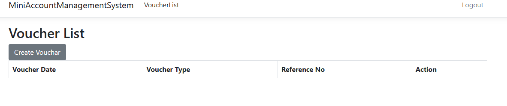

# MiniAccountManagementSystem

## Project Setup Guideline

1. **Clone the Repository**  
   `https://github.com/istiaquechowdhury/MiniAccountManagementSystem`

2. **Create a Database in SQL Server Management Studio (SSMS)**  
   - Open SSMS.  
   - Create a new database and name it **MiniAccountsDB** .

3. **Execute the Database Script**  
   - Open the file **/SqlScripts/DatabaseSetup.sql**.  
   - Copy its entire SQL content.  
   - In SSMS, select the **MiniAccountsDB** database, paste the script into a new query window, and **Execute**.

4. **Run the EF-Core Migration for ASP.NET Identity**  
   - In Visual Studio’s **Package Manager Console** (or any terminal), run:  
   
     "dotnet ef database update --project MiniAccountManagementSystem.DataAccess  --startup-project MiniAccountManagementSystem  --context ApplicationIdentityDbContext -- --output-dir ApplicationDB/Migrations"
   
   - This command adds the seven built-in ASP.NET Identity tables to the same database.

That’s it—run the project and navigate using the navigation bar on the first page.

---

### Roles

| Role | Username | Password | Can Access |
|------|----------|----------|------------|
| **Admin** | `admin@gmail.com` | `Pass@123` | **AddUser**, **AddRole**, **AssignAccess**, **AssignUserRole** |
| **Accountant** | `accountant@gmail.com` | `Pass@123` | **ChartOfAccounts**, **VoucherList** |
| **Viewer** | Any self-registered user | *(chosen at signup)* | VoucherList |

Newly registered users are automatically placed in the **Viewer** role.

1. Landing Page

2. Login As Admin

3. Admin's View

4. Add Role Validation

5. Adding Cashier Role

6. Added Cashier Role (Toaster Alert)

7. Add User Validation

8. Adding New User

9. New User Added (Toaster Alert)

10. Assigning Access (Step 1)

11. Assigning Access (Step 2)

12. Added Access

13. Assigned Access (Toaster Alert)

14. Assigning Role To User (Step 1)

15. Assigning Role To User (Step 2)

16. Assigned Role Successfully (Toaster Alert)

17. Login As Accountant

18. Accountant's View

19. Create a Voucher

20. Voucher Create Page

21. Validation: Debit and Credit Must Be Equal

22. After Creating Voucher

23. Viewing Voucher Details

24. Editing Voucher

25. Error: Debit and Credit Not Equal

26. Update More Entries

27. Two More Entries Added

28. Delete Confirmation

29. After Deletion

30. Chart of Accounts Page

31. Creating Chart of Account

32. Chart of Account Created

33. Editing Chart of Account

34. Chart of Account Edited Successfully

35. Pressing Delete on Chart

36. Chart of Account Deleted

37. Registering As Viewer

38. Login As Viewer

39. Viewer Dashboard

40. Viewer Can See Voucher List Only

41. Viewer Cannot Create

