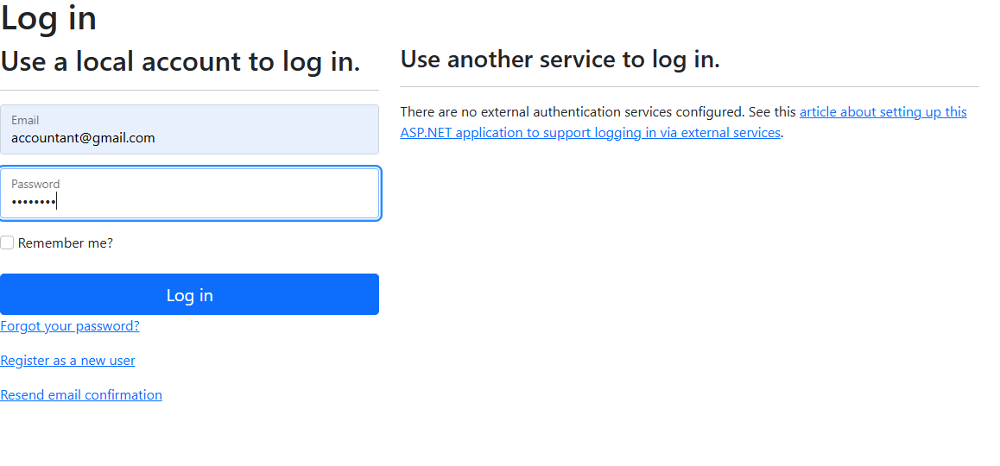

# MiniAccountManagementSystem

## Project Setup Guideline

1. **Clone the Repository**  
   `https://github.com/istiaquechowdhury/MiniAccountManagementSystem`

2. **Create a Database in SQL Server Management Studio (SSMS)**  
   - Open SSMS.  
   - Create a new database and name it **MiniAccountsDB** .

3. **Execute the Database Script**  
   - Open the file **/SqlScripts/DatabaseSetup.sql**.  
   - Copy its entire SQL content.  
   - In SSMS, select the **MiniAccountsDB** database, paste the script into a new query window, and **Execute**.

4. **Run the EF-Core Migration for ASP.NET Identity**  
   - In Visual Studio’s **Package Manager Console** (or any terminal), run:  
   
     "dotnet ef database update --project MiniAccountManagementSystem.DataAccess  --startup-project MiniAccountManagementSystem  --context ApplicationIdentityDbContext -- --output-dir ApplicationDB/Migrations"
   
   - This command adds the seven built-in ASP.NET Identity tables to the same database.

That’s it—run the project and navigate using the navigation bar on the first page.

---

### Roles

| Role | Username | Password | Can Access |
|------|----------|----------|------------|
| **Admin** | `admin@gmail.com` | `Pass@123` | **AddUser**, **AddRole**, **AssignAccess**, **AssignUserRole** |
| **Accountant** | `accountant@gmail.com` | `Pass@123` | **ChartOfAccounts**, **VoucherList** |
| **Viewer** | Any self-registered user | *(chosen at signup)* | VoucherList |

Newly registered users are automatically placed in the **Viewer** role.

### 1. Landing Page  

### 2. Login As Admin  

### 3. Admin's View  

### 4. Add Role Validation  

### 5. Adding Cashier Role  

### 6. Added Cashier Role Toaster Alert  

### 7. Add User Validation  

### 8. Adding New User  

### 9. New User Added Toaster Alert  

### 10. Assigning Access  

### 11. Assigning Access (Step 2)  

### 12. Access Added  

### 13. Assigned Access Toaster  

### 14. Assigning Role To User  

### 15. Assigning Role To User (Step 2)  

### 16. Assigned Role To User Successfully Toaster  

### 17. Login As Accountant  

### 18. View Of Accountant  

### 19. Create a Voucher  

### 20. Voucher Create Page  

### 21. Debit and Credit Must Be Equal Validation  

### 22. After Creating Voucher  

### 23. View Voucher Details  

### 24. Edit Voucher Page  

### 25. Debit and Credit Not Equal Error  

### 26. Update More Entries  

### 27. Two More Entries Added  

### 28. Delete Confirmation  

### 29. Entry Deleted  

### 30. Chart of Account Page  

### 31. Creating Chart of Account  

### 32. Chart of Account Created  

### 33. Editing Chart of Account  

### 34. Chart of Account Edited Successfully  

### 35. Delete Chart of Account  

### 36. Chart of Accounts Deleted  

### 37. Registering As Viewer  

### 38. Login As Viewer  

### 39. Viewer Login View  

### 40. Viewer Can Only See Voucher List  

### 41. Viewer Cannot Create Voucher  

